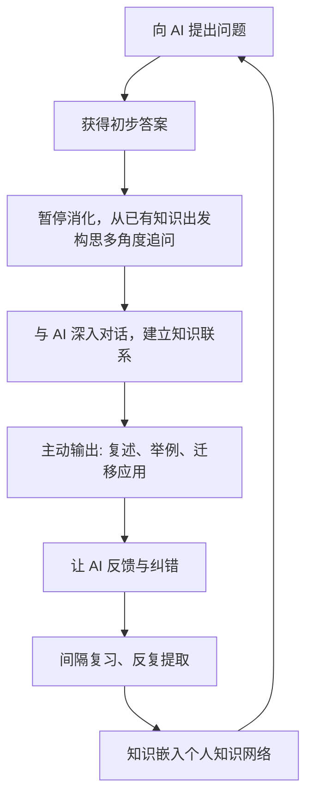

# 笔记
学习中，AI占比越来越多，但却没有提升我们的学习效率。这是因为我们的大脑天生并不是为了那么快的学习而设计的。

AI给的答案又好又快，很像导航的时候导航软件一下就把要去的目的地规划好了。导航软件出现后，一个城市的地图慢慢不在是网状的，而是点与点之间自己常去的地方，变成了点与点之间离散的，我知道可以从a点到b点，但是从a点到b点这个路径周围有什么，什么东西在哪个方位，而在大脑里头丢失了，所以我们的学习需要形成一种网状知识结构。概念与概念之间丰富的链接。

如果{color:#f97316}AI给的答案太方便、太直接{/color}，无论什么东西都可以用AI问，那么我们{color:#f97316}丧失掉的就是我们需要用大脑被迫地去把这些知识整理成网的必要性{/color}。

我们的好奇心分两个两个来源：自身自发的好奇、当前要完成一个任务被迫地需要去好奇，知道这个东西怎么解决。这个被迫的好奇心就被AI杀死了，因为你知道当你要完成一个任务的时候，没必要再去专注地思考，自己当下应该如何获得这个答案。

好奇心是注意力的先决条件，注意力是记忆力的先决条件。当被迫的好奇心被杀死后，你从内到外的好奇心又不够强大，那么你在学习AI给你的答案的时候，自然而然不会给它太多注意力，自然而然就不能形成足够多的记忆。所以，我们在AI给我们一个路径之后，很重要的一个点就是说，你需要更它{color:#06b6d4}反复对话，与你当前的知识网络可能发生联系的方方面面，进行深入的对谈，形成一份独属于自己的知识{/color}，这份知识可以被更容易地{color:#06b6d4}嵌入到你当前的网络知识结构里面{/color}，这样记忆就可以更坚固一些。

第二个问题就是{color:#f97316}AI答案来的太快{/color}了。我们大脑先天不适应那么快的答案。当答案来的太快的时候，我们大脑{color:#ef4444}没有时间去消化它，没有发呆的时间去把它整合进我们的知识脉络里{/color}。我们不停地与AI对话，不停地获得新的答案与新的知识，一整天下来头发胀、脑发蒙。为什么强调发呆和无聊的重要性，就是因为我们大脑会趁发呆无聊的时候帮我们把知识整合进我们的知识网络里。如果一刻不停，都在输入的话，它没有这个机会。

再就是{color:#22c55e}Ai给我们答案的时候，它其实一直是在调用我们的知识输入通路{/color}，就是说我们下来再见到这个答案，我可能能读懂，但是与我有能力把这个知识用出来是两回事。如果想把它用出来，你就被迫的需要去做这种输出的练习，而与AI对话的这个过程中，其实你只是不停地追问，和它不停地告诉你，你没有机会去给周围的人讲，没有机会去用这个知识。

 

再就是我们{color:#f97316}问AI的问题{/color}，我们{color:#f97316}很少重复地问{/color}。一个问题问过AI后，好像明白了。这种好像明白是最致命的，因为它{color:#f97316}阻止我们去复习{/color}。世界上有太多答案等我们去追寻的时候，我们就不会把过往的几个答案去好好地细细地品味和琢磨，{color:#f97316}而神经元链接的形成，记忆的形成，一个知识真正被写进皮层里面，它却恰恰需要很多次的重复的{/color}。我们很少会把自己的好奇心停留在一个问题上面来回地去琢磨它，那么就很少给自己的记忆系统一个机会去把这个知识真正地刻进我们自己的大脑皮层里面。

 

所以在AI时代的学习，不得不强调的一件事就是我们还是要慢下来，去多跟它探索，去多跟它在一轮轮地对话中找到属于你自己、能跟你自己现有的知识概念建立起联系的那个答案，并且多去温习它。

 

我自己在读论文的时候，还在维持着自己手写笔记的习惯，只是为了让自己慢下来，只是为了在越多的时候，能够通过手写的方式，一方面给自己发呆和仔细琢磨的时间，另外一方面，手写的触觉本身也可以给知识进入你的记忆系统多一条脉络。知识每多一条脉络进入就多一个途径进入你的记忆系统。无论是触觉听觉视觉，尝试把它说出来，有输入有输出。这种方方面面的综合、身体各个感官的结合才可以帮助一个知识更牢靠地写进你的脑子里

***

针对这3个问题：

1. AI 的反馈过于便捷、直接，削弱了我们主动用大脑将知识编织成网络的必要过程。解决方法是：从自身知识网络中可能产生关联的多个角度出发，反复与 AI 深入对话，将其转化为自己的理解，从而更自然地嵌入已有的知识结构。

2. AI 的反馈太快，使我们缺少消化、沉淀，以及将其整合进自身知识网络的时间。在与 AI 对话的过程中，我们往往只是不断追问，而它不断回应，整个过程主要调用的是我们的知识输入通路。仅仅“懂了”并不够；若想真正用出来，就必须进行输出练习。

3. 我们很少重复向 AI 提问，这在一定程度上削弱了复习。然而，神经元连接的建立、记忆的形成，以及知识真正写入大脑皮层，恰恰都依赖多次重复。解决方法是：有意识地反复温习。

***

你这三点可以概括为一个核心判断：

> AI降低了知识获取的摩擦, 但也可能削弱了知识内化所必需的三种认知过程: 主动组织、延迟消化、重复巩固。

可以整理成下面这个结构。

***

# AI学习的三个主要风险与应对方法

## 1. 答案太方便, 削弱主动建构知识网络的过程

AI给出的答案往往太直接、太完整, 这会减少我们自己动脑整理知识的机会。

但真正的学习不是简单地获得答案, 而是把新知识嵌入已有的知识网络中。也就是说, 我们需要不断思考:

* 这个知识和我已经知道的什么有关?

* 它能解释哪些现象?

* 它和哪些概念相似或相反?

* 它能放进哪个更大的框架里?

* 如果换一个角度看, 它还成立吗?

如果只是被动接收AI给出的结论, 知识很容易停留在表层。

### 解决方法

不要只问AI一个问题, 然后接受答案。应该围绕同一个知识点, 从多个角度反复追问, 进行深入对谈。

例如可以追问:

* 这个概念和哪些概念容易混淆?

* 它的底层原理是什么?

* 能不能举三个不同领域的例子?

* 如果反过来看, 它还成立吗?

* 它在现实中有什么应用?

* 它和我之前学过的某个知识有什么联系?

* 能不能帮我画出它的知识结构图?

这样做的目的不是让AI替你整理知识, 而是借助AI不断激活你自己的知识网络, 让新知识更容易嵌入进去。

***

## 2. 答案太快, 削弱消化和整合的时间

AI的反馈速度很快, 这看似提高了学习效率, 但也可能带来一个问题: 我们没有足够的停顿时间去消化。

人在真正理解一个知识时, 往往需要一些“空白时间”。

比如:

* 发呆

* 回想

* 自己复述

* 举例

* 画图

* 写笔记

* 和旧知识建立联系

这些过程看起来不像是在“学习”, 但其实是知识内化的重要环节。

如果和AI对话时只是不断追问、不断获得答案, 那么大脑一直处于输入状态。你可能会产生一种“我懂了”的感觉, 但这种懂往往还没有转化为真正可调用的能力。

### 解决方法

在AI给出答案之后, 不要立刻继续问下一个问题。可以强迫自己做输出练习。

例如:

1. 关掉AI, 自己复述一遍。
2. 用自己的话写出核心观点。
3. 举一个自己的例子。
4. 尝试向别人解释。
5. 把这个知识用于解决一个具体问题。
6. 让AI不要直接回答, 而是考你。
7. 让AI根据你的回答指出漏洞。

学习的关键不只是“输入”, 而是从输入转向输出。

可以把过程变成:

> AI解释 -> 自己复述 -> AI纠错 -> 自己举例 -> AI追问 -> 自己应用

这样才能真正把“知道”变成“会用”。

***

## 3. 问AI的问题很少重复, 削弱复习和记忆巩固

使用AI时, 我们很容易不断提出新问题, 追求新鲜感和即时解答。但这样会导致一个问题: 很少重复回到同一个知识点。

可是从认知科学和神经机制来看, 记忆的形成依赖反复激活。

一个知识要真正被写入长期记忆, 需要多次重复、多次提取、多次使用。神经元之间的连接不是一次理解就能稳定形成的, 而是通过反复调用才会加强。

所以, 如果我们只是在AI那里“问过一次”, 很可能只是短暂理解, 并没有真正记住。

### 解决方法

需要主动设计复习机制。

可以这样做:

* 定期让AI根据之前学过的内容出题。

* 让AI隔几天追问你同一个问题。

* 把重要问题整理成复习清单。

* 对同一个知识点进行多轮复述。

* 用间隔重复的方式回顾。

* 每次复习时不要先看答案, 而是先尝试自己回答。

例如可以对AI说:

> 请你根据我们之前讨论的内容, 用提问的方式考我, 不要直接告诉我答案。

或者:

> 请你把这个知识点设计成7天复习计划, 每天用不同方式考察我。

真正有效的复习不是重新阅读答案, 而是主动回忆和重新表达。

***

# 总结成一个学习闭环

你这三点其实可以组合成一个完整的AI辅助学习闭环:

***
这个闭环表达的是一种把 AI 从“答案机器”转化为“学习伙伴”的学习流程。它的核心不是让 AI 直接替你完成思考，而是借助 AI 触发问题、提供材料，再通过自己的暂停消化、多角度追问、主动输出、反馈纠错和间隔复习，最终让知识真正进入自己的知识网络。

## 1. 向 AI 提出问题

学习从一个问题开始。这个问题可以是一个概念、一个困惑、一个案例，也可以是一个想要解决的实际任务。

关键在于，不要只问“答案是什么”，而要尽量问出自己的困惑点。例如：

- “这个概念是什么意思？”
- “我卡在哪里？”
- “这个问题可以从哪些角度理解？”
- “我现在的理解对不对？”
- “它在真实场景中怎么用？”

问题越具体，AI 给出的反馈越容易成为后续思考的材料。

## 2. 获得初步答案

AI 会快速给出一个相对完整、清晰的答案。这个阶段的作用是降低理解门槛，让你先获得一个基本框架。

但这里需要注意：**获得答案不等于掌握知识**。

AI 给出的初步答案只是一个起点，它解决的是“我先知道大概是什么”的问题，还没有完成真正的内化。真正的学习不是停留在“看懂答案”，而是要继续追问、连接、输出和复习。

## 3. 暂停消化，从已有知识出发构思多角度追问

拿到 AI 的初步答案后，不要马上继续输入，也不要急着进入下一个问题，而是先暂停一下，给大脑一点消化和整理的时间。

这个阶段的核心不是单纯“休息”，而是从自己已有的知识出发，寻找新知识可以接入的位置，并据此构思下一轮多角度追问。也就是说，暂停消化的过程，本质上就是在让新知识和旧知识发生联系。

这一阶段可以思考：

- 这个知识和我以前学过的什么概念相似？
- 它和哪些已有知识存在区别？
- 它能解释我见过的哪些现象？
- 它可以放进我原有知识体系的哪个位置？
- 它和我过去的理解有没有冲突？
- 它在什么情况下成立，又在什么情况下不成立？
- 我可以从哪些角度继续问 AI？

所以，“构思追问”并不是为了问更多问题，而是为了让新知识逐渐接入自己的知识网络。真正有价值的追问，往往来自你已有知识与新知识之间的连接、冲突、空白和疑惑。

## 4. 与 AI 深入对话，验证并深化知识联系

在第 3 步中，我们已经从已有知识出发，构思出了一些追问角度。接下来，就要把这些问题带回与 AI 的对话中，通过深入交流来验证和深化这些知识联系。

这个阶段的重点不是简单地继续获取更多信息，而是检查自己刚才建立的联系是否准确、是否完整、是否有边界。

可以这样问 AI：

- “我把它理解成……这样对吗？”
- “它和我以前学过的……有什么相同和不同？”
- “我能不能把它类比为……？”
- “这个例子是否能说明这个概念？”
- “有没有反例能说明这个理解不成立？”
- “它适用于哪些场景，不适用于哪些场景？”
- “如果放到另一个领域中，这个理解还能成立吗？”

这一步的价值在于：  
让 AI 不再只是提供答案，而是帮助你检查、修正和拓展自己的知识连接。通过这种深入对话，新知识会逐渐从一个孤立的信息点，变成你已有知识网络中的一个节点。

## 5. 主动输出

如果只是看懂，知识仍然停留在输入层面。要判断自己是否真的掌握，必须主动输出。

输出的方式包括：

- 用自己的话复述；
- 举一个自己的例子；
- 写一段总结；
- 做一道题；
- 用它解释一个现象；
- 把它讲给别人听；
- 用它解决一个实际问题。

这个阶段会暴露一个关键问题：你以为自己懂了，但一输出就发现很多地方说不清。

而这些说不清的地方，恰恰是下一轮学习最有价值的入口。因为它们会告诉你：哪些地方只是“看懂了”，但还没有真正掌握。

## 6. 让 AI 反馈与纠错

完成输出后，可以把自己的复述、例子、总结或应用过程交给 AI，让它帮你检查。

例如可以问：

- “我这样理解对吗？”
- “哪里不准确？”
- “有没有逻辑漏洞？”
- “这个例子是否合适？”
- “我的表达有没有遗漏关键点？”
- “能不能帮我指出理解不清的地方？”

这一步的价值在于，把 AI 从“直接给答案的人”变成“反馈者”和“纠错者”。

这样一来，你不是被动接收答案，而是在主动表达之后获得修正。AI 的作用也从“替你思考”变成了“帮助你检查自己的思考”。

## 7. 间隔复习并反复提取

记忆并不是一次理解就能形成的。神经元连接的巩固需要重复，而有效的重复不是简单重看，而是反复提取。

所谓提取，就是先不看答案，尝试自己回忆和表达：

- “这个概念的核心是什么？”
- “我上次学到了哪几个要点？”
- “我能不能不用笔记讲出来？”
- “我能不能举出一个新例子？”
- “我能不能把它用到一个新问题里？”

间隔复习可以安排在：

- 当天稍后；
- 第二天；
- 三天后；
- 一周后；
- 一个月后。

每一次提取，都是在加固知识路径。重复不是机械地看一遍，而是不断把知识从大脑中调取出来。知识被调取的次数越多，它就越容易被稳定地写入记忆。

## 8. 知识嵌入个人知识网络

经过提问、消化、追问、连接、输出、纠错和复习之后，知识才不再是 AI 给你的外部信息，而会逐渐变成你自己的知识。

所谓“嵌入个人知识网络”，意味着：

- 你能用自己的话说出来；
- 你知道它和哪些知识有关；
- 你知道它适用于哪些场景；
- 你知道它有哪些边界；
- 你能在需要时调用它；
- 它能帮助你理解新的问题。

到这一步，知识才真正从“看过”变成“会用”。

## 9. 为什么最后又回到“向 AI 提出问题”

这个闭环最后回到起点，是因为学习不是一次性的线性过程，而是不断循环的过程。

当一个知识被嵌入你的知识网络后，它会带来新的问题：

- “这个知识还能解释什么？”
- “有没有更深层的原理？”
- “它和另一个领域是否相通？”
- “它在更复杂的问题里怎么用？”
- “我之前的理解是否需要修正？”

于是你又可以带着更高质量的问题重新询问 AI，进入下一轮学习。

也就是说，AI 学习的关键不是一次性得到完美答案，而是在一轮又一轮的提问、消化、追问、输出、反馈和复习中，把外部信息逐渐转化为自己的知识结构。

## 总结

这个闭环的关键是：

**输入只是开始，暂停消化才能生成更好的问题，多角度追问才能建立联系，主动输出才能暴露问题，反馈纠错才能修正理解，间隔复习才能真正巩固。**

AI 最有价值的用法，不是让它直接替你思考，而是让它参与到你的学习循环中，帮助你不断提问、连接、表达、修正和复习。

真正重要的不是更快得到答案，而是通过这个闭环，把答案转化为自己的知识。

# 可以提炼成一句话

> 使用 AI 学习时，不能只把 AI 当成答案机器，而要把它当成对话者、教练和复习伙伴。真正重要的不是更快得到答案，而是通过暂停消化、多角度追问、主动输出和反复复习，把答案转化为自己的知识结构。

更简洁一点：

> AI 负责加速获取信息，但知识的内化仍然需要你自己完成：消化思考、建立联系、主动输出、反馈纠错、反复复习。